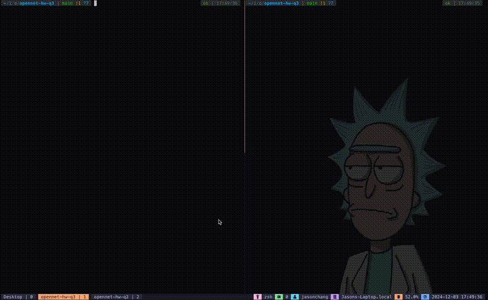

# Question 3: API Creation

## How to run?

### Prerequisites
- `Docker` or `Python 3.13` installed on your machine.
- Make sure port 5001 is not used.

### Steps

1. Setup server
```bash
# clone the repository
$ git clone git@github.com:JasonJungler/opennet-hw-q3.git

# 1 - Running with docker
# build the docker image
$ docker build -t flask-api .

# run the docker container
$ docker run -d -p 5001:5001 flask-api

# 2 - Running with Python

# Setup virtual environment using the tool you preferred
# 1. python -m venv .venv && source .venv/bin/activate && pip install -r requirements.txt
# 2. uv sync (https://docs.astral.sh/uv/)

# activate virtual environment
$ source .venv/bin/activate

# start flask server
(.venv)$ python src/app.py 
```

2. Testing with `curl`
```bash
# test with `curl` without name
curl "http://localhost:5001/greet"
# Response: {"message":"Hello, World!"}

# test with `curl` with name
curl "http://localhost:5001/greet?name=JasonChang"
# Response: {"message":"Hello, JasonChang!"}
```

## Project directory

```bash
.
├── Dockerfile
├── README.md
├── demo.gif
├── pyproject.toml
├── requirements.txt
└── src
    └── app.py
```

## Demo




